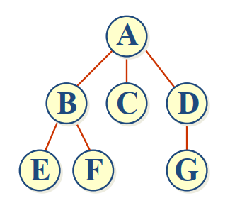
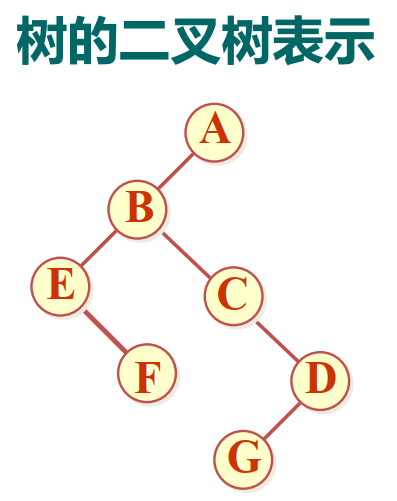

# 树

## 1. 二叉树(Binary Tree)

### 1.1 性质

1. 若二叉树节点的层次从 1 开始，则在二叉树的第 $i$ 层最多有 $2^{i-1}$ 个节点。($i \ge 1$)
2. 深度为 $k$ 的二叉树最少有 $k$ 个节点，最多有 $2^k-1$ 个节点。
3. 对任何一棵二叉树，如果其叶节点有 $n_0$ 个，度为 2 的节点有 $n_2$ 个，则有 $$ n_0=n_2+1 $$
4.  具有 $n$ 个节点的完全二叉树的深度为 $\lceil log_2(n+1) \rceil$。
5. 将一棵具有 $n$ 个节点的二叉树自顶向下、自左向右从 1 开始编号，则有：
   * 若 $i=1$，则 $i$ 无父节点
   * 若 $i\gt1$，则 $i$ 的父节点为 $\lfloor \dfrac{i}{2} \rfloor$ 
   * 若 $2i \le n$，则 $i$ 的左子女为 $2i$，若 $2i+1 \le n$，则 $i$ 的右子女为 $2i+1$ 
   * 若 $i$ 为奇数，且 $i \ne 1$，则其左兄弟为 $i-1$
   * 若 $i$ 为偶数，且 $i \ne n$，则其右兄弟为 $i+1$

## 2. 线索化二叉树(Threaded Binary Tree)

### 2.1 思想

* 通过二叉树的遍历，将二叉树中的所有节点数据排列在一个线性序列中。

### 2.2 实现方法

1. 增加 pred 和 succ 指针
   * 每个节点增加两个指针，存储开销大
2. 增加左右线索标志
   * ltag / rtag = 0: 表示左/右子女节点
   * ltag / rtag = 1: 表示前驱/后继线索

## 3. 树与森林

### 3.1 树的存储表示



1. 广义表表示：A(B(E, F), C, D(G))

2. 双亲表示

   | index      |  0   |  1   |  2   |  3   |  4   |  5   |  6   |
   | ---------- | :--: | :--: | :--: | :--: | :--: | :--: | :--: |
   | **data**   |  A   |  B   |  C   |  D   |  E   |  F   |  G   |
   | **parent** |  -1  |  0   |  0   |  0   |  1   |  1   |  3   |

3. 子女链表表示

   ```java
   A -> 1 -> 2 -> 3
   B -> 4 -> 5
   C
   D -> 6
   E
   F
   G
   ```

4. 子女指针表示：每个节点存有一个足够大是数组用以存储子女指针，但会导致大量空链域的产生

5. 子女-兄弟表示

   * 节点构造：data, firstChild, nextSibling

   ```c++
   A, B, nullptr;
   B, E, C;
   C, nullptr, D;
   D, G, nullptr;
   E, nullptr, F;
   F, nullptr, nullptr;
   G, nullptr, nullptr;
   ```

## 4. 树的遍历



### 4.1 先根次序遍历

* 先访问根节点，再依此访问各棵子树

* 对应二叉树的前序遍历

  `A -> B -> E -> F -> C -> D -> G`

### 4.2 后根次序遍历

+ 对应二叉树的中序遍历

  `E -> F -> B -> C -> G -> D -> A`

### 4.3 广度优先遍历

```c++
template<class T>
void Tree<T>::levelOrder(void (*visit)(BinTreeNode<T> *node)) {
    queue<TreeNode<T>*> q;
    TreeNode<T> *temp;
    if (current != nullptr) {
        temp = current;
        q.push(current);
        while (!q.empty()) {
            visit(q.top());
            q.pop();
            current = current->firstChild;
            while (current != nullptr) {
                q.push(current);
                current = current->nextSibling;
            }
        }
        current = temp;
    }
}
```

## 5. 堆

> 堆可以实现优先队列的存储表示

### 5.1 堆的元素下标计算

+ 节点 $i$ 的父节点为节点 $\lfloor\dfrac{i-1}{2}\rfloor\quad(i\ne0)$
+ 节点 $i$ 的左子女为节点 $2i+1\quad(2i+1<n)​$
+ 节点 $i$ 的右子女为节点 $2i+2\quad(2i+2<n)$

## 6. Huffman 树

### 6.1 路径长度(Path Length)

+ 两个节点之间的路径长度 PL = 连接两个节点的路径上的分支数
+ 外部路径长度 EPL = 各叶节点（外节点）到根节点的路径长度之和
+ 内部路径长度 IPL = 各非叶节点（内节点）到根节点的路径长度之和
+ PL = EPL + IPL
+ $n$ 个节点的二叉树的 PL **不小于** $\sum\limits_{i-1}^n\lfloor\log_2i\rfloor$，当该二叉树是完全二叉树或理想平衡树时，取得该最小值。

### 6.2 带权路径长度

+ 扩充二叉树：只有度为 2 的内节点和度为 0 的外节点

+ 扩充二叉树的带权路径长度 = **各外节点到根**的带权路径长度之和：

  ​							$$ WPL=\sum\limits_{i=1}^n w_i \cdot l_i $$

### 6.3 Huffman 树的构造算法

> 带权路径长度达到最小的扩充二叉树称为 Huffman 树

1. 给定 $n$ 个权值 ${w_0,w_1,...,w_{n-1}}$，构造具有 $n$ 棵扩充二叉树的森林 $F={T_0,T_1,...,T_{n-1}}$，其中每棵扩充二叉树只有一个带权值 $w_i$ 的根节点，其左、右子树均为空。
2. 重复以下步骤，直到 $F$ 中仅剩一棵树：
   + 在 $F$ 中选取两棵根结点的权值最小的扩充二叉树，做为左、右子树构造一棵新的二叉树。置新的二叉树的根结点的权值为其左、右子树上根结点的权值之和。
   + 在 $F$ 中删去这两棵二叉树。
   + 把新的二叉树加入 $F$。