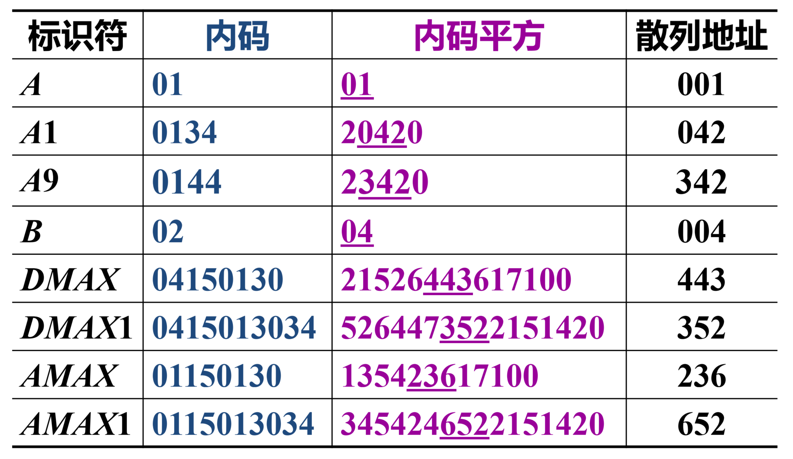
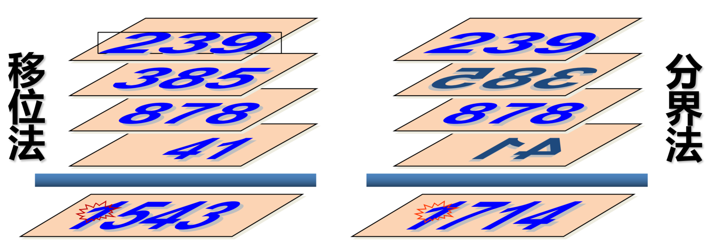
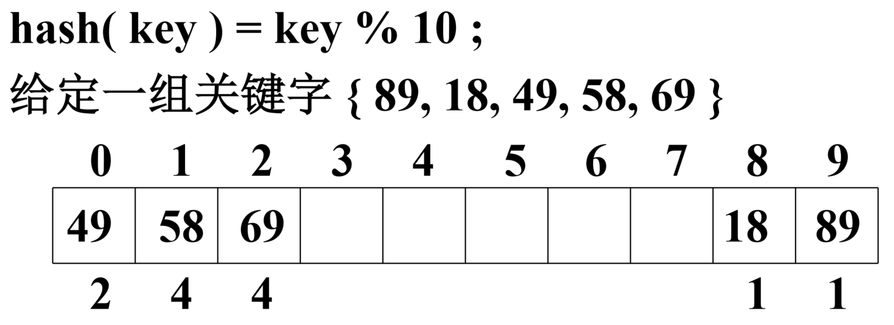
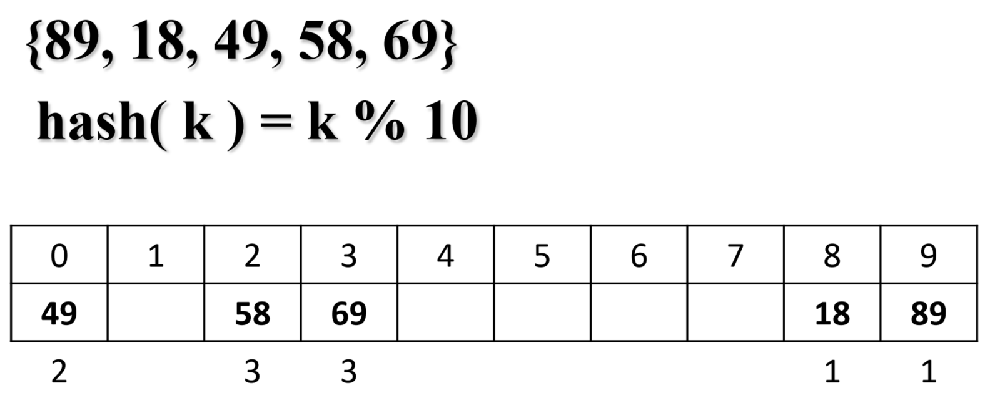
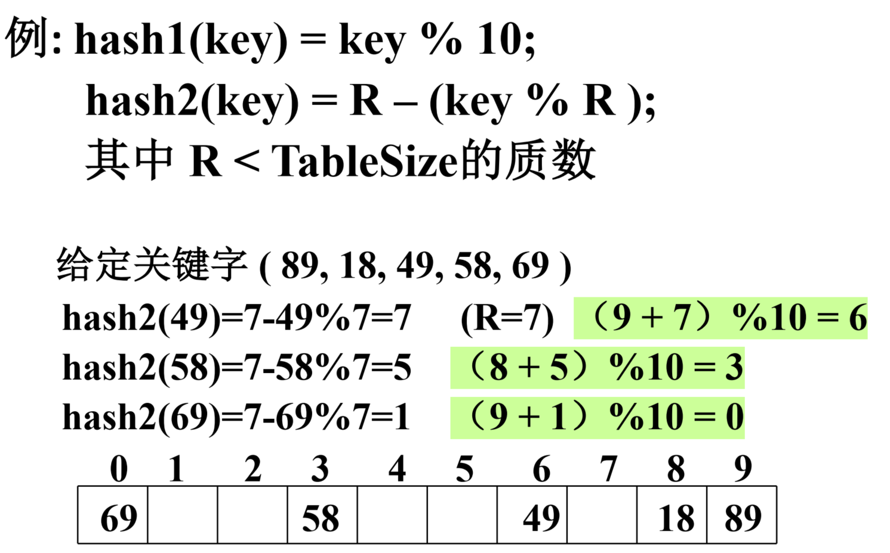

# 集合和字典

## 1. 集合及其表示

>  集合中所有成员也需要是相同的数据类型

1. 位向量
   + 使用一个二进制数字表示 $\{0,1,2,...,n\}$ 中对应位置的元素是否出现在集合中
   + 使用 16 位无符号整数来存储
   + 适用于全集合是有限个可枚举的，这样就可以建立成员与正整数一一对应的关系

2. 有序链表
   + 各节点成员在链表中升序排列
   + 可以表示无穷全集合的子集

## 2. 并查集与等价类

### 2.1 等价类

+ 如果一个集合 $S$ 中的所有对象可以通过等价关系划分为若干个互不相交的子集 $S_1,S_2,...$，那么 $S$ 就称为等价类。

### 2.2 并查集(Union-Find Sets)

+ 建立等价类的一种方案：将等价类的每一个元素看成是单元素集合，然后反复使用搜索（Find）运算，确定一个元素在哪个集合中。如果两个等价对的元素不在同一个集合，则进行合并（Union）。
+ 表示方法：树的双亲表示
+ 算法过程：
  + 读入等价对 $[i][j]$
  + 用 Find(i) 和 Find(j) 搜索 $i,j$ 所属的子集合 $x,y$
  + 若 $x\ne y$，用 Union(x, y) 或 Union(y, x) 将它们合并
+ 但是 Find 和 Union 的性能并不好（$O(n^2)$），需要改进 Union 的方法：
  + 按树节点个数进行合并
  + 按树的高度进行合并
  + 按压缩元素的路径长度进行合并

## 3. 字典

> 可以把字典定义为 <key, value> 对的集合

### 3.1 存储结构

1. 有序顺序表
2. 有序链表

### 3.2 ASL 分析

1. 定义：ASL (Average Search Length，平均搜索长度)，是衡量一个搜索算法时间效率的标准
   设搜索第 $i$ 各元素的概率为 $p_i$，搜索到第 $i$ 个元素所需要比较的次数为 $c_i$，则搜索成功的 ASL 为：$ ASL_{succ}=\sum\limits_{i=1}^n p_i \cdot c_i $
2. 顺序搜索
   + $ASL_{succ}=\dfrac{1}{n}\sum\limits_{i=1}^ni=\dfrac{n+1}{2}$
   + $ASL_{unsucc}=\dfrac{1}{n+1}\left( n+\sum\limits_{i=1}^ni \right)$
3. 二分搜索（若 $n=2^h-1$，$h$ 为二叉搜索树的深度）
   + $ASL_{succ}=\dfrac{1}{n}(1\times2^0+2\times2^1+ \cdots +h\times2^{h-1})=(h-1)\times2^h+1=\dfrac{n+1}{n}\log_2(n+1)-1$

## 4. 散列(Hash Table)

> 理想的搜索方法可以不经过比较，直接通过存储位置和键之间的对应函数关系（hash 函数）得到。

### 4.1 常见 hash 函数

1. 直接定址法

   + $hash(key)=a\cdot key+b$
   + 此方法一般不会发生冲突，但是要求散列地址空间的大小与键集合的大小相同

2. 数字分析法

   + 设有 $n$ 个 $d$ 位数，每位上可能会出现 $r$ 种不同的符号。这 $r$ 种符号在各位上出现的概率不一定相同。可以根据散列表的大小，选取其中**各种符号分布均匀的若干位**作为散列地址
   + 计算符号分布均匀度的 $\lambda_k$ 公式：$\lambda_k=\sum\limits_{i=1}^r(\alpha_i^k-\dfrac{n}{r})^2$
   + 其中 $\alpha_i^k$ 是第 $i$ 个符号在第 $k$ 位上出现的次数，$\dfrac{n}{r}$ 表示各种符号在 $n$ 个数中均匀出现的期望。
   + $\lambda_k$ 越小，说明第 $k$ 位上各种符号分布得越均匀。
   + 但是数字分析法仅适用于事先明确知道表中所有关键码每一位数值的分布情况。

3. 除留余数法

   + 设散列表种允许的地址数为 $m$，取一个最接近 $m$ 的质数 $p$：
   + $hash(key)=key \;\% \;p $

4. 平方取中法

   + 首先计算构成键的标识符的内码的平方，然后按照散列表的大小取中间的若干位作为散列地址。

     

5. 折叠法

   + 将键自左向右分成位数相等的几部分，每部分位数与散列表地址位数相同（除了最后一个）

   + 叠加方法（e.g. key = 23938587841）

     + 移位法：把各部分最后一位对齐相加
     + 分界法：沿各部分边界来回折叠，然后对齐相加

     

### 4.2 处理冲突的方法

1. 线性探查法：发生冲突时直接顺次向后寻找下一个位置

   **ASL 分析**：

   

   + $ASL_{succ}=\dfrac{1+1+2+4+4}{5}=\dfrac{12}{5}$
   + $ASL_{unsucc}=\dfrac{4+3+2+1+1+1+1+1+5+6}{10}=3$

2. 平方探查法：发生冲突时顺次向后寻找 $d+1,d+2^2,d+3^2\cdots​$

   

   + $ASL_{succ}=\dfrac{1+1+2+3+3}{5}=2$

3. 二次散列

   + 设 $hash_1(key)=d$，$hash_2(key)=c$，则发生冲突时，顺次检查地址 $d+c,d+2c,d+3c \cdots$

   

4. 链地址法

   + 用链表储存冲突的 value

   

   + 

5. 