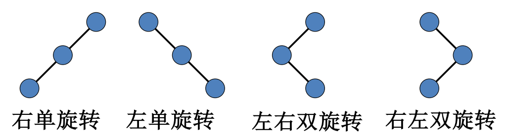

# 搜索结构

## 1. 静态搜索结构

+ 顺序搜索的
  $ASL_{succ}=\sum\limits_{i=0}^{n-1}\dfrac{i+1}{n}=\dfrac{1}{n}\cdot \dfrac{n(n+1)}{2}=\dfrac{n+1}{2}$
  $ASL_{unsucc}=\dfrac{1}{n+1}\left( \sum\limits_{i=1}^ni+n \right)$
+ 有序顺序表的二分搜索的
  $ASL_{succ}=\dfrac{1}{n}(1\times2^0+2\times2^1+ \cdots +h\times2^{h-1})=(h-1)\times2^h+1=\dfrac{n+1}{n}\log_2(n+1)-1​$

## 2. 二叉搜索树

1. 定义
   + 左子树上所有节点的 key 均小于根节点的 key
   + 右子树上所有节点的 key 均大于根节点的 key
   + 左子树和右子树也是二叉搜索树

## 3. AVL 树

1. 定义

   + 本身为二叉搜索树

   + 左子树和右子树的高度差的绝对值不超过 1
   + 左子树和右子树都是 AVL 树

2. 平衡因子 (balance factor)

   + bf = 该节点右子树高度 - 左子树高度
   + $\text{bf}\in\{-1,0,1\}$

3. 平衡化旋转

   + 每插入一个新节点，AVL 树中相关的节点的平衡状态可能发生改变
   + 因此，插入时需要从插入位置沿通向根的路径回溯，检查各节点的平衡因子
   + 如果在某一结点发现高度不平衡，停止回溯，沿回溯的路径取直接下两层的节点
   + 如果三个节点共线，采用单旋转；反之，采用双旋转

   

