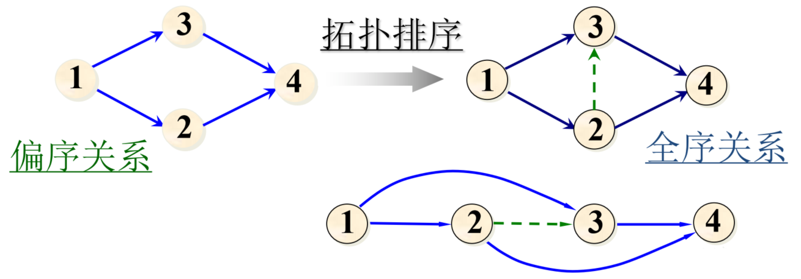

# 图

## 1. 图的存储

1. 邻接矩阵(Adjacency Matrix)

   + 设图 $G=(V,E)​$ 是一个有 $n​$ 各顶点的图，图的邻接矩阵为 $A.edge[n][n]​$，则：

   $$ \qquad\qquad\qquad\qquad\qquad A.edge[i][j]=\left\{ \begin{array}{ll} 1, & \text{if} \;(i,j)\in E \\ 0, & \text{otherwise}\end{array} \right. $$

   + 如果是带权图，则 $ A.edge[i][j]=\left\{ \begin{array}{ll} W(i,j), & \text{if} \;i\ne j \land (i,j)\in E \\ \infty, & \text{if} \; i\ne j \land (i,j)\notin E \\ 0, & \text{if} \; i =j\end{array} \right.  $

2. 邻接表(Adjacency List)

   + 用 vector 存储顶点与哪些顶点相连

## 2. 图的遍历与连通性

### 2.1 图的遍历

1. DFS：在访问某一起始顶点 $v$ 后：
   + 由 $v$ 出发，访问它的任意邻接顶点 $w_1$
   + 再从 $w_1$ 出发，访问与 $w_1$ 邻接且没有访问过的顶点 $w_2$
   + 再从 $w_2$ 出发，进行类似的访问，直至到达所有邻接顶点都被访问过的顶点 $u$
   + 回退一步到前一次访问过的顶点，看是否还有未访问过的顶点。如果有，就按前述步骤访问；没有就进一步回退进行搜索
   + 重复上述过程，直到图中所有顶点都被访问过为止
2. BFS：在访问某一起始顶点 $v$ 后：
   + 由 $v$ 出发，依次访问 $v$ 的各个未被访问过的邻接顶点 $w_1,w_2,\cdots,w_t$
   + 再按顺序访问 $w_1,w_2,\cdots,w_t​$，的所有未被访问过的邻接顶点
   + 重复上述操作，直到图中所有顶点都被访问过为止

### 2.2 图的连通性

## 3. 最小生成树

1. 构造准则
   + 必须使用且仅使用该网络中的 $n-1$ 条边来连接网络中的 $n$ 个顶点
   + 不能使用能产生回路的边
   + 各边上的权值的总和达到最小
2. Kruskal 算法
   + 设有一个有 $n$ 个顶点的连通网络 $N=\{V,E\}​$
   + 构造一个只有 $n​$ 个顶点，没有边的非连通图 $T=\{V,\empty\}​$，图中每个顶点自成一个连通分量
   + 在 $E$ 中选择一条具有最小权值的边，如果该边的两个顶点落在不同连通分量上，则将此边加入到 $T$ 中；否则将此边舍去，重新选择一条权值最小的边
   + 重复上一步，直到所有顶点在同一个连通分量上
3. Prim 算法
   + 从连通网络 $N=\{V,E\}$ 中的某一顶点 $u_0$ 出发，选择与它关联的具有最小权值的边 $(u_0,v)$，将 $v$ 加入生成树顶点集合 $U$ 中。
   + 从一个顶点在集合 $U$ 中，另一个不在的各条边中选择权值最小的边 $(u, v)$，将 $v$ 加入集合 $U$ 中。
   + 重复上一步，直到网络中的所有顶点都加入到了生成树顶点集合 $U$ 中为止。
4. 总结
   + Kruskal 算法适用于边稀疏的情形
   + Prim 算法适用于边稠密的情形

## 4. 最短路径

1. Dijkstra 算法：边权值非负情形的单源最短路径问题
   + 引入辅助数组 dist，dist[i] 表示当前找到的从源点 $v_0$ 到终点 $v_i$ 的最短路径的长度。
   + 假设 $S$ 是已求得的最短路径的终点的集合，则可证明：下一条最短路径必然是从 $v_0$ 出发，中间只经过 $S$ 中的顶点便可达到的那些顶点 $v_x$ 的路径中的一条。
   + 每次求得一条最短路径后，其终点 $v_k$ 加入集合 $S$，然后对所有的 $v_i\in V-S$，修改 dist[i] 的值
2. Bellman 和 Ford 算法：边权值为任意值的单源最短路径问题（不讲）
3. Floyd 算法：所有顶点之间的最短路径算法（边权 $>0$）
   + 定义 $n$ 阶方阵序列：$A^{(-1)},A^{(0)},\cdots,A^{(n-1)}$
   + 其中，$A^{(-1)}[i][j]=\text{Edge}[i][j]$
   + $A^{(k)}[i][j]=\min\{A^{(k-1)}[i][j],A^{(k-1)}[i][k]+A^{(k-1)}[k][j]\}, k=0,1,\cdots,n-1$
   + 理解：
     + $A^{(0)}[i][j]$ 是从顶点 $v_i$ 到 $v_j$，中间顶点是 $v_0$ 的最短路径长度
     + $A^{(k)}[i][j]$ 是从顶点 $v_i$ 到 $v_j$，中间顶点不大于 $v_k$ 的最短路径的长度
     + $A^{(n-1)}[i][j]$ 是从顶点 $v_i$ 到 $v_j$ 的最短路径长度

## 5. 活动网络

### 5.1 AOV 网络(Activity on Vertices)

1. 定义：顶点表示活动，有向边<$v_i,v_j$>表示活动 $v_i$ 先于 $v_j$ 进行
2. 要求：不出现有向环
3. 拓扑排序：将各个顶点排列成一个线性有序的序列，使得 AOV 网络中所有应存在的前驱和后继关系都满足。
   
   + 如果一个 AOV 网络经过拓扑排序后的序列拓扑有序，则该网络中没有有向环，称该 AOV 网络代表的工程问题可行。
   + 算法描述：
     + 在 AOV 网络中选一个没有直接前驱的顶点（可以通过 count 数组记录每个顶点的入度）。
     + 从图中删去该节点，同时删去所有从其出发的边。
     + 重复以上步骤，直到全部顶点均以输出，拓扑有序序列形成；或图中还有顶点未删去，但已跳出处理循环，说明它们有直接前驱，进一步说明图中存在有向环。
   + 同时需要维护一个存放入度为 0 的顶点的链式栈，当栈不为空时，重复以下步骤：
     + 从栈顶退出一个顶点，并从 AOV 网络中删去该顶点
     + 如果删去的边的终顶点的入度变为 0，将该顶点入栈
   + 如果从栈中删去的顶点个数少于 AOV 网络中的顶点数，则网络中存在有向环。
   + 为了节省空间，可以利用 count 数组作为栈，只需要维护栈顶指针 top。

### 5.2 AOE 网络(Activity on Edges)

1. 设定
   + 用有向边表示一个工程的活动，边上的权值表示活动所需时间，顶点表示事件
   + 起始点为**源点**，结束点为**汇点**
   + 从源点到汇点的路径可能不止一条
   + 只有各条路径上所有活动都完成了，整个工程才算完成
   + 完成整个工程所需时间取决于从源点到汇点的最长路径长度，这条路径长度最长的路径叫做**关键路径**
   + 要找关键路径，必须先找出**关键活动**，即不按期完成就会影响整个工程完成的活动
   + 关键路径上的所有活动都是关键活动，只要找到了关键活动，也就找到了关键路径
   + 事件 $V_i$ 的最早可能开始时间 $Ve[i]$ 是从源点 $V_0$ 到顶点 $V_i$ 的最长路径长度
   + 事件 $V_i$ 的最晚允许开始时间 $Vl[i]$ 是在保证汇点 $V_{n-1}$ 在 $Ve[n-1]$ 时刻完成的前提下，事件 $V_i$ 允许的最晚开始时间
   + 活动 <$V_i,V_j$> 的最早可能开始时间 $e[k]$ 是从源点 $V_0$ 到顶点 $V_i$ 的最长路径长度，即 $e[k]=Ve[i]$
   + 活动 <$V_i,V_j$> 的最晚允许开始时间 $l[k]$ 是在不会引起时间延误的前提下，活动允许的最迟开始时间，即 $l[k]=Vl[j]-\text{weight}$
   + 时间余量 $:=l[k]-e[k]$
   +  $l[k]==e[k]$ 的活动为关键活动
2. $Ve[i]$ 和 $Vl[i]$
   + $Ve[0]=0,Ve[j]=\max\{ Ve[i]+\text{weight}(V_i,V_j) \}$
   + $Vl[n-1]=Ve[n-1],Vl[j]=\min\{ Vl[k]-\text{weight}(V_j,V_k) \}$
   + 注：这两个递推公式必须在 AOE 网络拓扑有序及逆拓扑有序的前提下才能使用
3. 注
   + 不是任意关键活动加速都能使整个工程提前完成，要考虑各个关键路径上的所有活动
   + 任意关键活动延迟，整个工程就要延迟

