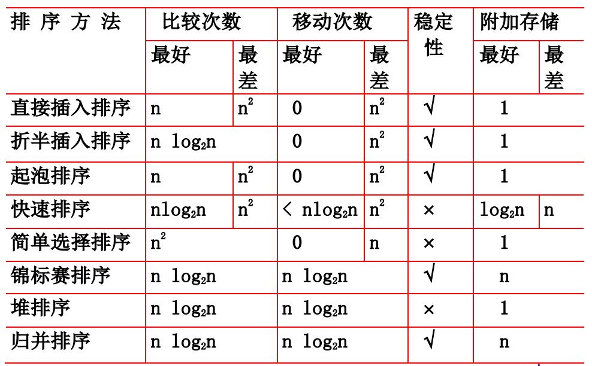

# 排序算法

## 0. 概述

1. 衡量排序算法优劣的标准
   + 稳定性：相等元素排序前的先后顺序在排序后不变
   + 时间开销：可用数据比较次数和数据移动次数来衡量
   + 算法执行所需的附加存储

## 1. 插入排序

### 1.1 直接插入排序

1. 基本思想
   + 当插入第 $i$ 个元素时，前面的 $i-1$ 个元素已经排好序，这时只要将其与前 $i-1$ 个元素顺序比较即可。
2. 分析
   + 设元素个数为 $n$
   + 最好情况：比较次数 $=n-1$，元素移动次数 $=0$
   + 最坏情况
     + 比较次数 $\text{KCN}=\sum\limits_{i=1}^{n-1}i=\dfrac{n(n-1)}{2}$
     + 元素移动次数 $\text{RMN}=\sum\limits_{i=1}^{n-1}(i+2)=\dfrac{(n+4)(n-1)}{2}$
   + 因此时间复杂度为 $o(n^2)$
   + 具有稳定性

### 1.2 折半插入排序

1. 基本思想
   + 将直接插入排序中的顺序查找改为折半查找
2. 分析
   + 比较次数 $=\sum\limits_{i=1}^{n-1}(\lfloor \log_2 i \rfloor+1)\approx n\log_2 n$
   + 元素移动次数与直接插入排序相同
   + 具有稳定性

### 1.3 希尔(Shell)排序

1. 基本思想
   + 先取一个整数 $\text{gap}<n$ 作为间隔，将元素分为 gap 个子序列，所有距离为 gap 的元素放在同一个子序列中
   + 对每个子序列实施直接插入排序
   + 缩小 gap，如 $\text{gap}=\lceil \dfrac{\text{gap}}{2} \rceil$，重复上述操作，直到 $\text{gap}==1$
2. 分析
   + 还没有人做到完整的数学证明
   + 大量实验统计表明，$n$ 很大时，平均比较次数和 元素平均移动次数大约在 $n^{1.25}$ 到 $1.6n^{1.25}$ 的范围内。
   + 不具有稳定性

## 2. 交换排序

### 2.1 冒泡排序

1. 分析
   + 最好情形：比较次数 $=n-1$，元素移动次数 $=0$
   + 最坏情形：
     + 比较次数 $\text{KCN}=\sum\limits_{i=1}^{n-1}(n-i)=\dfrac{1}{2}n(n-1)$
     + 元素移动次数 $\text{RMN}=3\sum\limits_{i=1}^{n-1}(n-i)=\dfrac{3}{2}n(n-1)$
   + 具有稳定性

### 2.2 快速排序

1. 基本思想
   + 将序列中的某个元素作为基准，将整个序列划分为两个子序列。左序列元素 $\le$ 基准元素；右序列元素 $\ge$ 基准元素。
   + 分别对两个子序列重复上述方法，直到所有元素都排在相应位置上为止。
2. 分析
   + 理想情况下，递归树高度为 $\lfloor \log_2(n+1) \rfloor$
   + 最坏情况下，元素比较次数 $=\sum\limits_{i=1}^{n-1}(n-i)=\dfrac{n(n-1)}{2}$
   + 因此快排是一种不稳定的排序算法
3. 随机化的快速排序
   + 对于每个待排序的子序列，在 split 前先将 $\text{list}[1]$ 和 $\text{list[r]}$ 交换（$r$ 是随机数）
   + 这样可以使时间复杂度到达 $O(n\log n)$

## 3. 选择排序

### 3.1 直接选择排序

1. 基本思想
   + 在一组元素 $V[i]\sim V[n-1]$ 中选择最小的元素
   + 如果它不在第一个位置，则与第一个元素对调
   + 在剩下的元素 $V[i+1]\sim V[n-1]$ 中重复上述过程，直到剩余元素只有一个
2. 分析
   + 比较次数 $KCN=\sum\limits_{i=0}^{n-2}(n-i-1)=\dfrac{n(n-1)}{2}$
   + 元素移动次数 $RMN=\left\{ \begin{array}{ll} 0, & 最好情况 \\ 3(n-1), & 最坏情况 \end{array}\right.$

### 3.2 锦标赛排序

1. 基本思想
   + 与淘汰赛类似，将 $n$ 个元素两两比较，得到 $\lceil \dfrac{n}{2} \rceil$ 个较小的元素，然后对这 $\lceil \dfrac{n}{2} \rceil$ 个元素继续两两比较，直到选出最小的元素
   + 将每次两两比较的结果上升到双亲节点，获得**胜者树**
2. 分析
   + 胜者树是完全二叉树，高度为 $\lceil \log_2n\rceil$
   + 除第一次选择最小元素需要 $n-1$ 次比较外，重构胜者树所需的比较次数均为 $O(\log n)$，因此总比较次数为 $O(n\log n)$
   + 虽然排序时间少，但是需要较多的附加存储，如果有 $n$ 个元素，则必须使用至少 $2n-1$ 个节点来存放胜者树
   + 具有稳定性

### 3.3 堆排序

1. 基本思想
   + 通过构建最大堆，将元素从小到大排序
2. 分析
   + 时间复杂性：$O(n\log n)$
   + 空间复杂性：$O(1)$
   + 不具有稳定性

## 4. 归并排序（二路归并）

1. 分析
   + 时间复杂度：$O(n\log n)$
   + 比较次数：$O(n\log n)$
   + 具有稳定性

## 5. 总结

