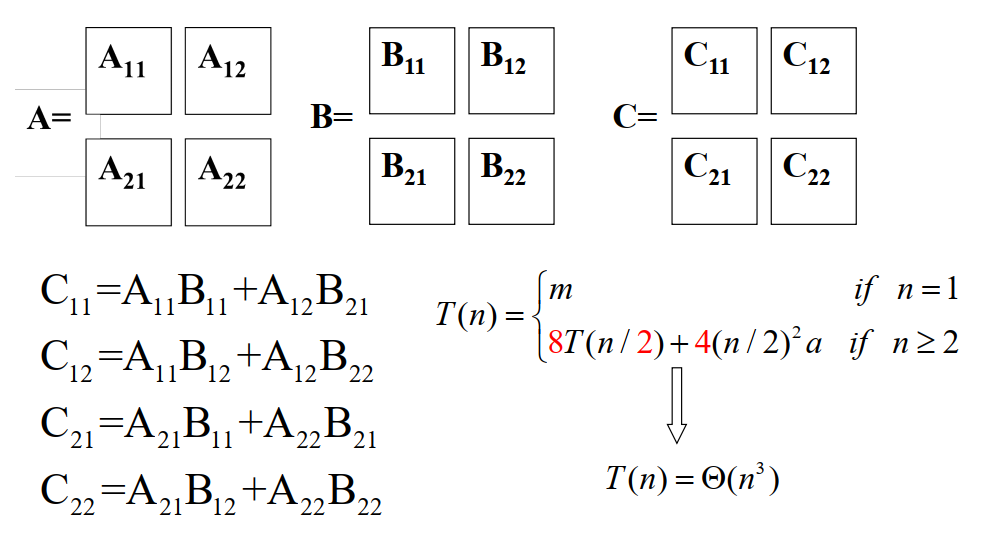
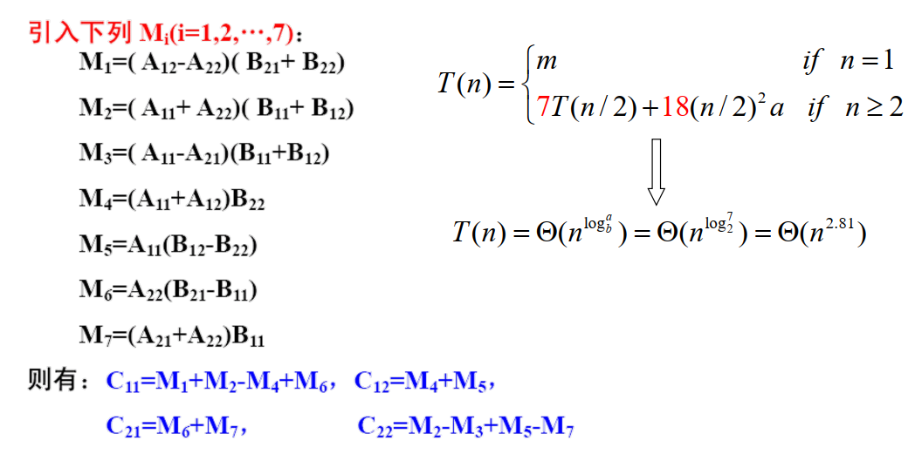

# 分治策略

## 1. 引例

> 快排和归并

## 2. 矩阵乘法

1. 直接相乘法

   + $c_{ij}=\sum\limits_{k=1}^na_{ik}b_{kj}$
   + $T(n)=n^2\cdot n\cdot m + n^2\cdot (n-1)\cdot a=O(n^3)$
   + $m$ 是一次乘法的时间，$a$ 是一次加法的时间

2. 分块矩阵法

   

3. Strassen 算法
   

