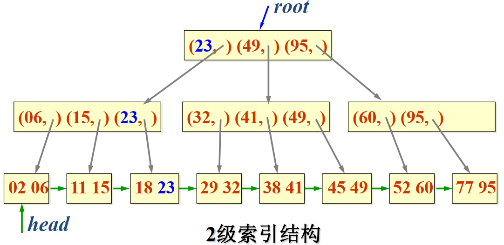
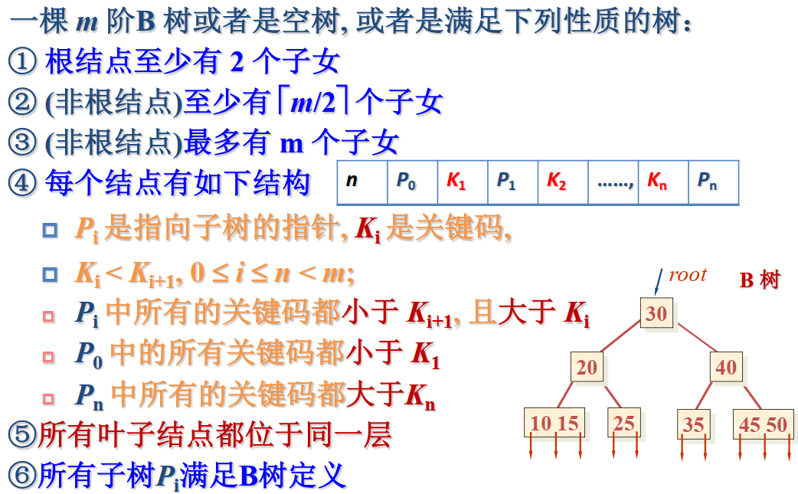
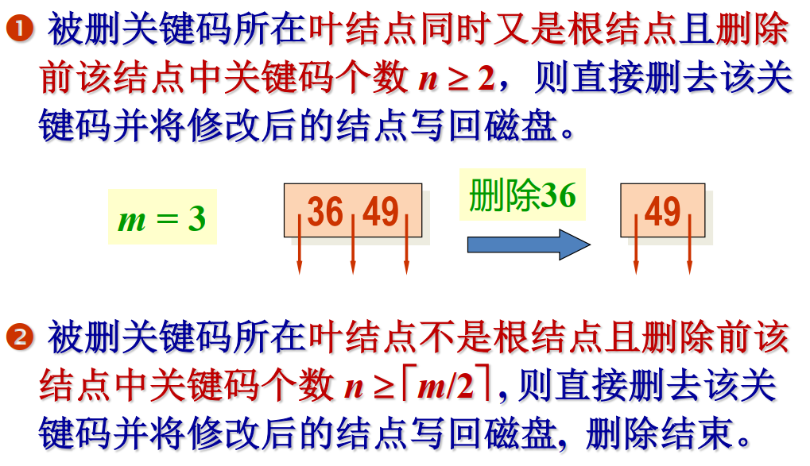
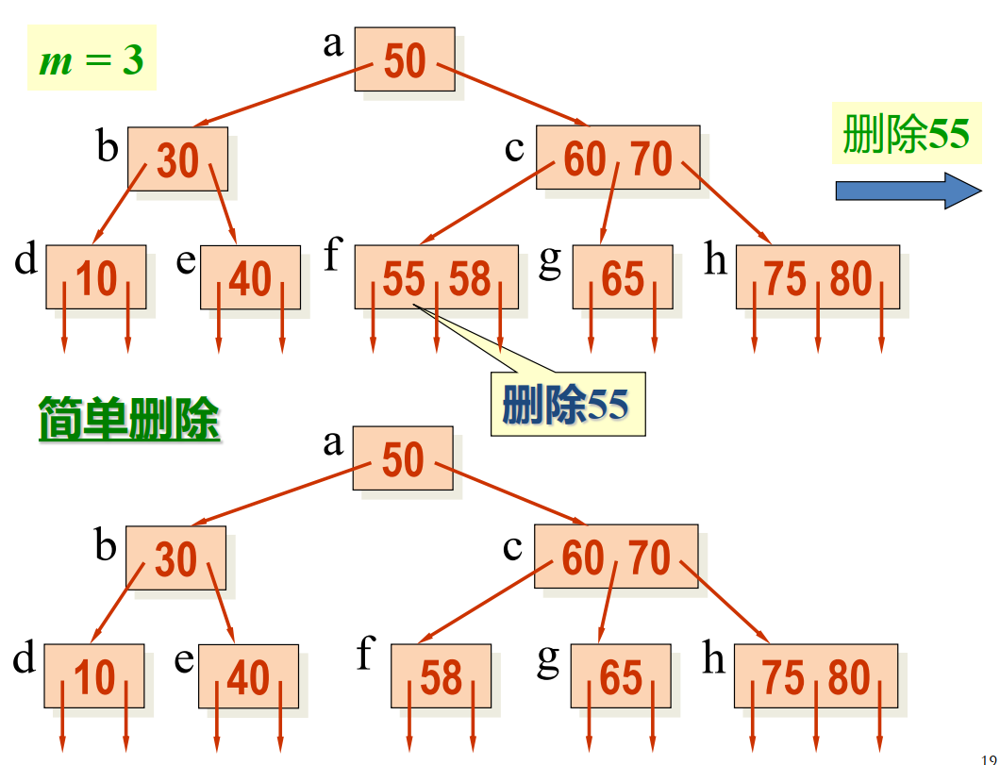
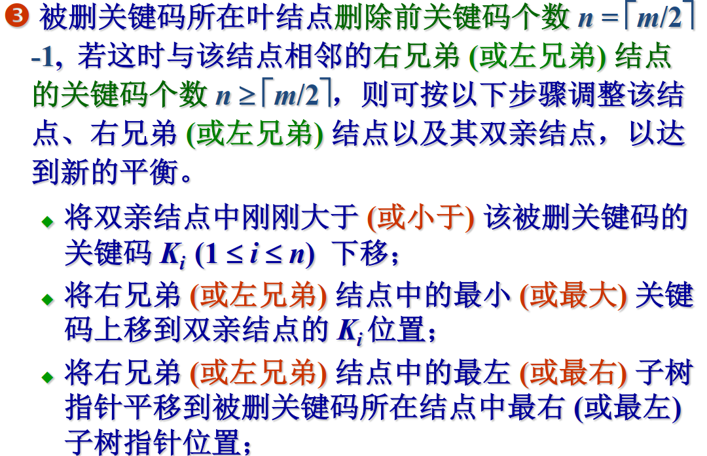
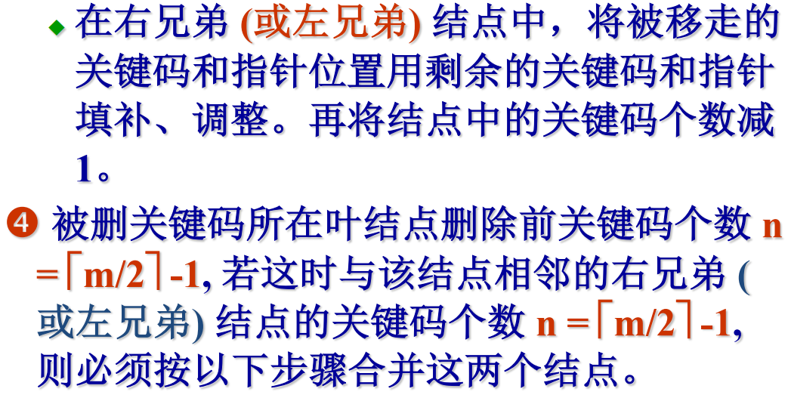

# 多级索引结构

## 1. B 树

+ 这种多级索引结构形成 $m$ 叉树。树中每一个分支结点表示一个索引块, 它最多存放 $m$ 个索引项，每个索引项分别给出各子树结点 (低一级索引块)的最大关键码和结点地址。
+  树的叶结点中各索引项给出在数据表中存放的记录的关键码和存放地址。这种 $m$ 叉树用来作为多级索引，就是 $m$ 路搜索树。
+ $m$ 路搜索树可能是静态索引结构，即结构在初始创建，数据装入时就已经定型，在整个运行期间，树的结构不发生变化。 
+ $m$ 路搜索树还可能是动态索引结构，即在整个系统运行期间，树的结构随数据的增删及时调整，以保持最佳的搜索效率。 

1. B 树的定义

   

2. B 树的插入

   + 每个节点的关键码个数在 $[\lceil\dfrac{m}{2}\rceil-1,m-1]$ 之间
   + 插入在某个叶结点开始。如果在关键码插入后结点中的关键码个数超出了上界 $m-1$，则结点需要“分裂”，否则可以直接插入。

3. B 树的删除

   + 关键码不在叶子节点时，用其前驱或后继来替换，将问题转化成删除叶子中的关键码。

   + 在叶节点删除关键码时，如果删除后关键码不够数，若左/右兄弟子树有多余的，从兄弟子树中借一个，否则进行合并。
     
     

     
     

4. 